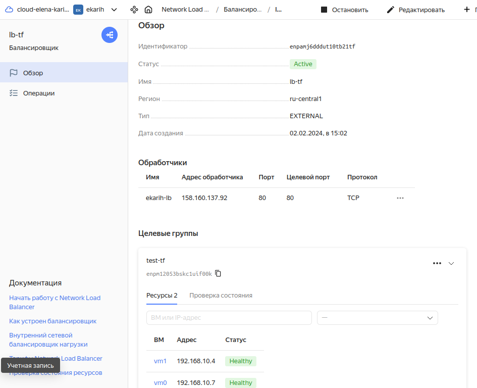
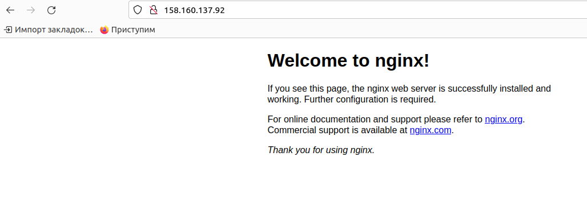
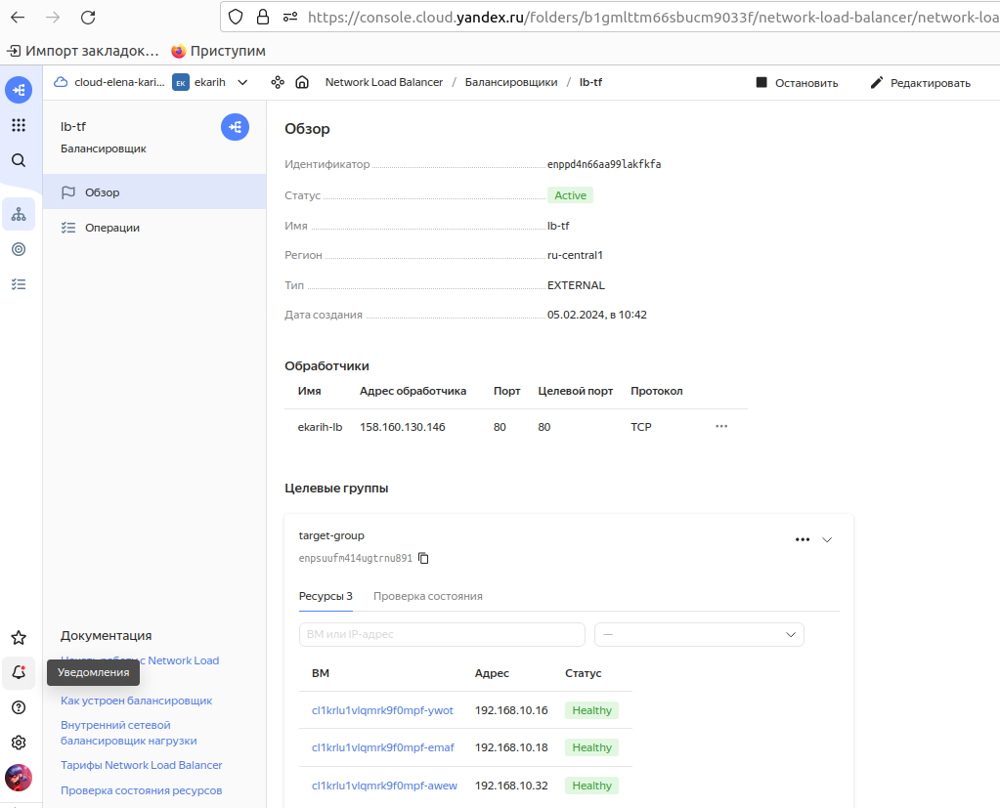
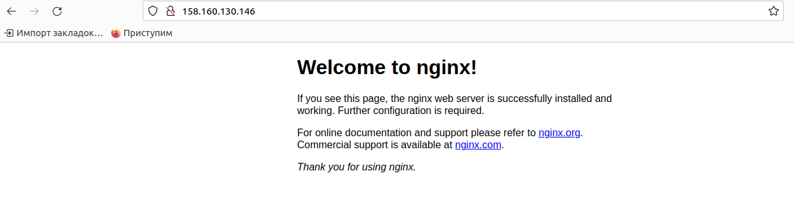

## Домашнее задание к занятию "Отказоустойчивость в облаке" - Карих Елена
---
### Задание 1

* Возьмите за основу решение к заданию 1 из занятия «Подъём инфраструктуры в Яндекс Облаке».
1. Теперь вместо одной виртуальной машины сделайте terraform playbook, который:
* создаст 2 идентичные виртуальные машины. Используйте аргумент count для создания таких ресурсов;
* создаст таргет-группу. Поместите в неё созданные на шаге 1 виртуальные машины;
* создаст сетевой балансировщик нагрузки, который слушает на порту 80, отправляет трафик на порт 80 виртуальных машин и http healthcheck на порт 80 виртуальных машин.

2. Установите на созданные виртуальные машины пакет Nginx любым удобным способом и запустите Nginx веб-сервер на порту 80.
3. Перейдите в веб-консоль Yandex Cloud и убедитесь, что:
* созданный балансировщик находится в статусе Active,
* обе виртуальные машины в целевой группе находятся в состоянии healthy.
4. Сделайте запрос на 80 порт на внешний IP-адрес балансировщика и убедитесь, что вы получаете ответ в виде дефолтной страницы Nginx.

  В качестве результата пришлите:

1. Terraform Playbook.
2. Скриншот статуса балансировщика и целевой группы.
3. Скриншот страницы, которая открылась при запросе IP-адреса балансировщика.

### Решение 1
1. Ссылка на terraform playbook: [main.tf](main_task1.tf)
2. 
3. 
---
### Задание 2

* Теперь вместо создания виртуальных машин создайте группу виртуальных машин с балансировщиком нагрузки.
1. Nginx нужно будет поставить тоже автоматизированно. Для этого вам нужно будет подложить файл установки Nginx в user-data-ключ метадаты виртуальной машины.
2. Перейдите в веб-консоль Yandex Cloud и убедитесь, что:
* созданный балансировщик находится в статусе Active,
* обе виртуальные машины в целевой группе находятся в состоянии healthy.
* cделайте запрос на 80 порт на внешний IP-адрес балансировщика и убедитесь, что вы получаете ответ в виде дефолтной страницы Nginx.

  В качестве результата пришлите
1. Terraform Playbook.
2. Скриншот статуса балансировщика и целевой группы.
3. Скриншот страницы, которая открылась при запросе IP-адреса балансировщика.
### Решение 2
1. Ссылка на terraform playbook: [main.tf](main_task2.tf)
2. 
3. 
---
